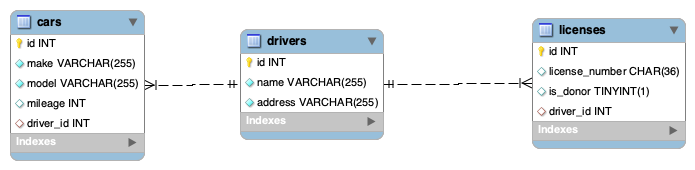

# Demo ORM Cars

```sql
DROP DATABASE IF EXISTS cars_db;
CREATE DATABASE cars_db;
```

---



---

## Routes

### Drivers

| Method | Route        | Description      |
| ------ | ------------ | ---------------- |
| GET    | /drivers     | Get all drivers  |
| GET    | /drivers/:id | Get driver by id |
