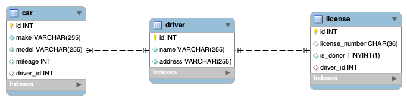

# Demo ORM Cars

```sql
DROP DATABASE IF EXISTS cars_db;
CREATE DATABASE cars_db;
```

---



---

## Routes and Endpoints

### Drivers

| Method | Endpoint         | Description      |
| ------ | ---------------- | ---------------- |
| GET    | /api/drivers/    | Get all drivers  |
| GET    | /api/drivers/:id | Get driver by id |
